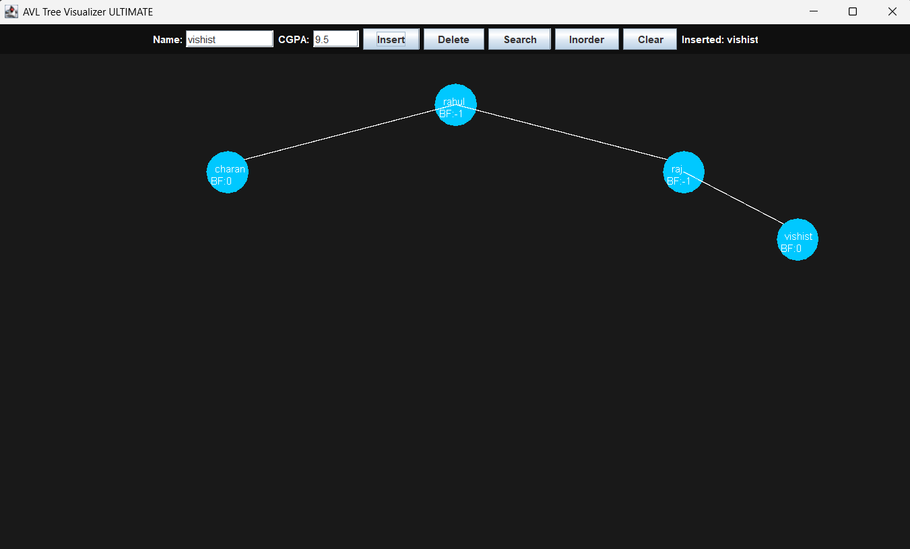

# 🌳 AVL Tree Visualizer (Java Swing)

Interactive AVL Tree Visualizer built using Java Swing with modern UI.

## 🚀 Features
- Insert nodes
- Delete nodes
- Search nodes
- Inorder traversal
- AVL rotations (LL, RR, LR, RL)
- Balance factor display
- Professional GUI

## 🛠 Tech Used
Java  
Swing GUI  
Data Structures (AVL Tree)

## ▶️ Run
javac AVLVisualizerUltimate.java  
java AVLVisualizerUltimate

## 📷 Screenshot
